# Lesson: Interaction Design

### First and Last Name: Σαββίδης Θεόφιλος
### University Registration Number: dpsd19115
### GitHub Personal Profile: https://github.com/Tsavvis
### Augmented Reality Personal Repository: https://github.com/Tsavvis/Augmented-Reality

# Introduction
 
 Περιγραφή της διαδικασίας δημιουργίας της ατομικής εργασίας Augmented-Reality για το μάθημα της Διαδραστικής Σχεδίασης 2022.
# Summary

# 1st Deliverable

Επιγραμματική καταγραφή δημιουργίας πρώτου παραδοτέου:
 -αναζήτηση πληροφοριών περί εντολών java στον συνδεσμο:https://aframe.io/aframe-school/#/
 -εύρεση εντολής:... για την δημιουργία κυλίνδρου και αντίστοιχα ... για σφαιρα
 -προσαρμογή χρωμάτων, διαστάσεων και τοποθεσίας του κυλίνδρου και της σφαίρας 
 -λίγο trial and error για να βρω τον συνδεασμό που μου αρεσει για τα χρώματα και τις διαστάσεις
 -αναζήτηση εντολών για την προσθήκη effect χιονιού
 -αναζήτηση και προσθήκη φωνητικών εντολών 
 -τεσταρισμα φωνητικών εντολών
 -τελικό ανέβασμα της εργασίας στο Add file --> Upload file
 -καταγραφή αναφοράς

# 2nd Deliverable
 
Ανάλυση τελικού παραδοτέου: 
Στα πλαίσια κατασκευής του δεύτερου παραδοτέου η διαδικασία ακολούθησε την εξής ροή. Αρχικά, έγινε δημιουργία των απαραίτητων markers μέσω του σύνδεσμου: https://aframe.io/docs/1.3.0/components/gltf-model.html 

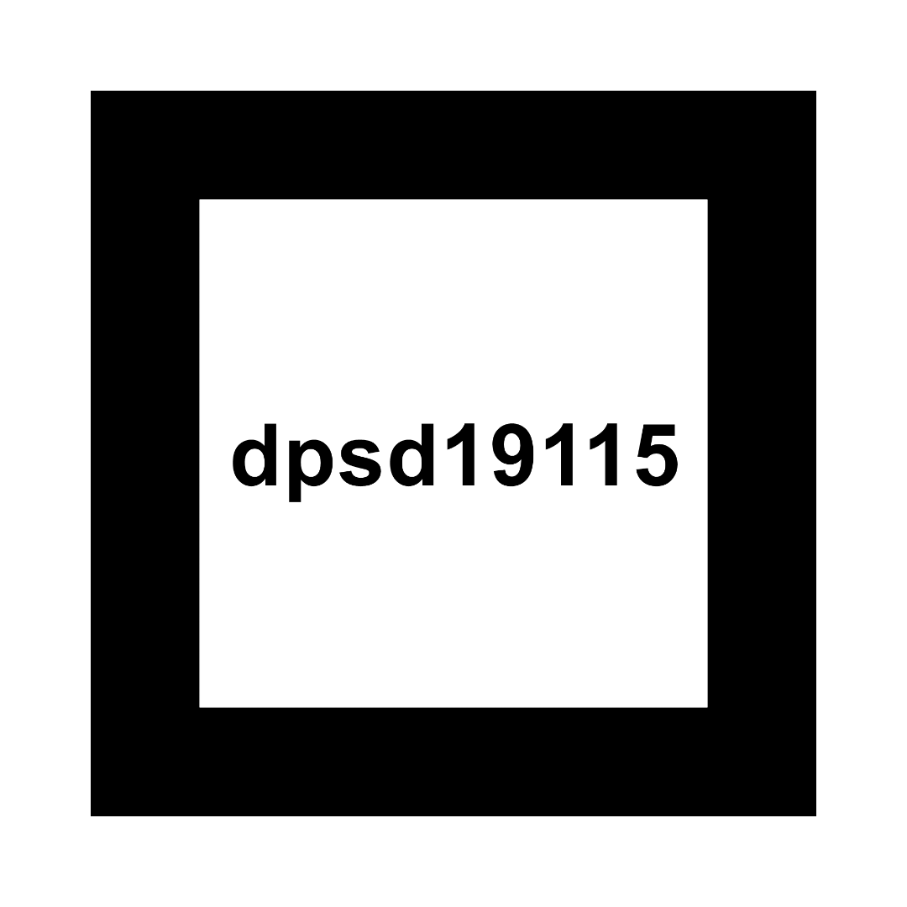
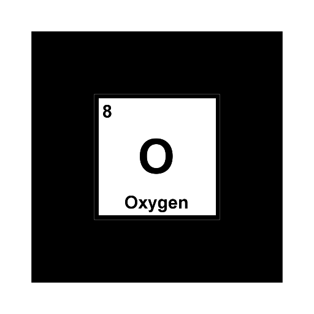

Έπειτα, έγινε το ανέβασμα των εικόνων στον φάκελο assets και ταυτοχρονα ξεκίνησε η δημιουργλια του κώδικα. 
Για να δουλευει το πρώτο κομμάτι του παραδοτέου, που ασχολειται με την εμφάνιση ενός γραπτου κειμένου με το όνομά μου,  συνοδευόμενο με μία εικόνα της επιλογής μου, ο κώδικας κατέληξε στην εξής μορφή  

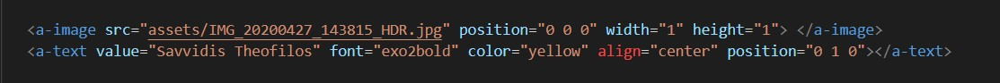

 
Κάποια από τα βασικά προβλήματα που αντιμετώπισα κατά την δημιουργία του τελικού αυτού κομματιού κώδικα, ήταν ότι το γραπτό κείμενο εμφανιζόταν κάθετο στην κάμερα και έτσι δε φαινόταν εκτός κι αν ο χτήστης αλλάξει γωνία θέασης του marker. Έτσι, άλλαξα την σειρά εμφάνισής τους με την εικόνα και τελικά έχουμε επιτυχία. Να σημειώθεί ότι την επόμενη μέρα που δούλεψα τον υπόλοιπο κώδικα του project και τέσταρα όλα τα μαρκερς για να είμαι σίγουρος ότι όλα πάνε καλά, κάνενα component δεν εμφανιζόταν, παρόλο που δεν έγινε καμία αλλαγή στον κώδικα, οπότε φαντάζομαι ότι υπήρχε κάποιο θέμα με την κάμερα μου.
 
Στη συνέχεια έχουμε την δημιουργία των 3D μοντέλων μέσω blender, στα οποία προσθέθηκε μία απλή κυκλική κίνηση, δημιουργώντας το animation. 

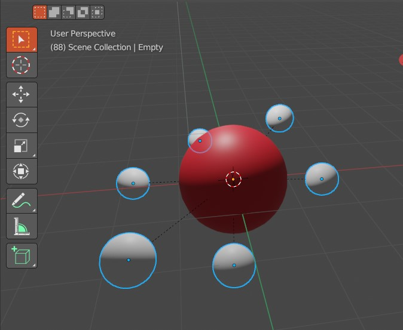
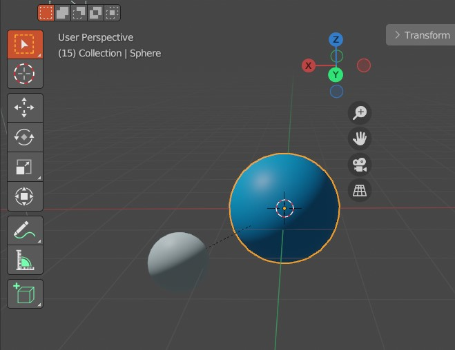

 
Από τους συνδέσμους που θα δείτε στην βιβλιιογραφία, βρέθηκαν οι τρόποι για να προσθέσω τα gltf αρχεία των animations και να εμφανίζονται στα markers.
 

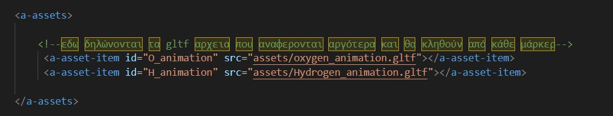

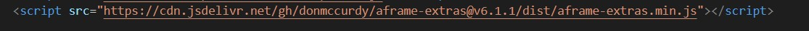

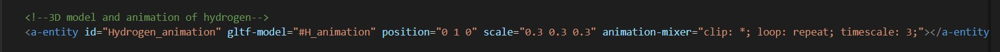

 
Τελικά αποτελέσματα:
 

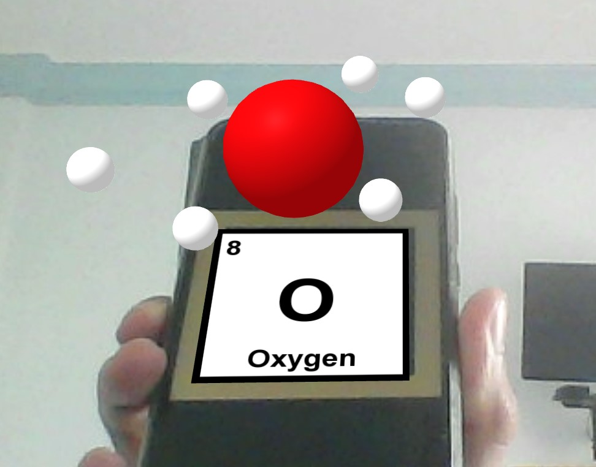
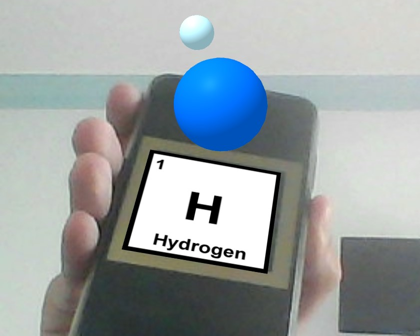

Τέλος, το τρίτο κομμάτι της εργασίας δε πρόλαβα να το ολοκληρώσω.

**Βιβλιογραφία**

https://aframe.io/docs/1.3.0/components/gltf-model.html 
https://github.com/stemkoski/AR.js-examples 

# 3rd Deliverable 

 Το συγεκριμενο κομμάτι της εργασίας με δυσκόλεψε από την άποψη ότι δεν εμφανιζόταν το 3D μοντελο. Αρχικό πρόβλημα ήταν ότι είχα τοποθετήσει το τις συντεταγμενες του simulate στο ίδιο σήμείο με τις συντεταγμενες του μοντελου. Αφού τις άλλαξα είχα την μόνη ευκαιρία να βγαλώ καποιο screenshot όπου φαινεται το μοντελο, αλλά δε το έκανα γιατι θεώρησα ότι απο δω και περα θα δουλεύει. Δυστυχώς, το μοντέλο δε ξαναεμφανίστηκε παρόλο που δεν άλλαξα τίποτε στον κώδικά του.
 

 
  
 Οι κώδικες που φαίνονται στα ακόλουθα σκρινσοτ, πάρθηκαν από τα site των sources και έχουν προσαρμωστεί για την εργασία
  
 

 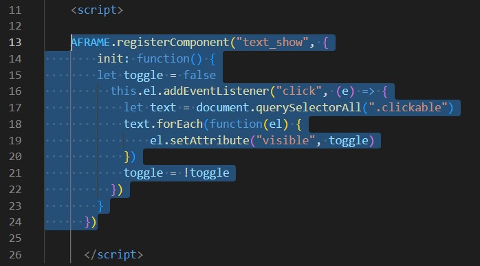
 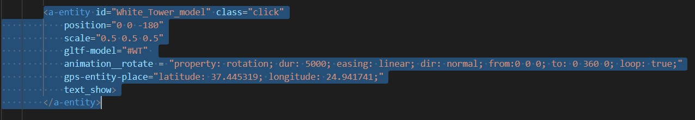
 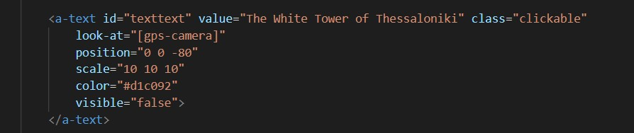
 

  
 
 
 **Βιβλιογραφία**

[https://aframe.io/docs/1.3.0/components/gltf-model.html](https://stackoverflow.com/questions/56465829/interaction-with-aframe-click-to-show) 
[https://github.com/stemkoski/AR.js-examples](https://github.com/AR-js-org/AR.js/blob/master/aframe/examples/location-based/always-face-user/index.html) 
https://ar-js-org.github.io/AR.js-Docs/location-based-tutorial/ 
https://ar-js-org.github.io/AR.js-Docs/location-based/#events  
https://aframe.io/docs/1.3.0/components/cursor.html  
Επίσης ο υπολογισμός των συντεταγμένων εγινέ από εδώ 
 https://www.latlong.net/ 
 
# Conclusions

# Sources
